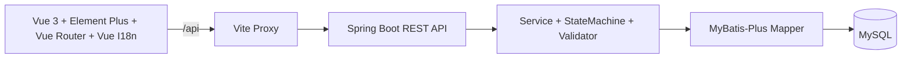

# Payments Processing System

支付处理系统课程项目（Spring Boot + Vue）。

本项目聚焦支付生命周期管理，覆盖以下核心能力：

1. 创建支付（含幂等键）。
2. 查询支付详情与状态。
3. 查询支付状态历史（audit trail）。
4. 按状态/关键字分页筛选支付。
5. 展示失败支付错误详情。

## 最新架构



状态机约束：

- CREATED -> VALIDATED 或 FAILED
- VALIDATED -> SENT 或 FAILED
- SENT -> COMPLETED 或 FAILED
- COMPLETED、FAILED 为终态

## 当前实现状态（最新）

| 模块 | 状态 | 说明 |
|---|---|---|
| 前端页面 | 已实现 | 列表、创建、详情页已完成，接口调用封装在 `fronted/api`。 |
| 前端国际化 | 已实现 | 已接入 `vue-i18n`，支持 `zh/en/de` 切换与持久化。 |
| 前端网络层 | 已实现 | Axios 统一响应拦截，支持统一错误提示。 |
| 后端控制器/服务 | 骨架 | 接口签名已齐全，核心业务仍有 `todo` 占位。 |
| 数据库脚本 | 已提供 | `schema.sql` 与 `data.sql` 可初始化库表和种子数据。 |
| API 契约文档 | 已更新 | 见 `api-interface-documentation.md`。 |

## 技术栈

- 前端：Vue 3、Vite、Element Plus、Axios、Vue Router、Vue I18n
- 后端：Spring Boot 3.5.4、JDK 22、Maven、MyBatis-Plus
- 数据库：MySQL 8
- API 文档：springdoc-openapi（Swagger UI）

## 目录结构

```text
Six/
├─ backend/
│  ├─ pom.xml
│  └─ src/main/
│     ├─ java/com/example/payments/
│     │  ├─ controller/
│     │  ├─ service/
│     │  ├─ mapper/
│     │  ├─ statemachine/
│     │  ├─ validator/
│     │  └─ dto/entity/enums/exception
│     └─ resources/
│        ├─ application.yml
│        ├─ application-dev.yml
│        ├─ db/
│        │  ├─ schema.sql
│        │  └─ data.sql
│        └─ mapper/
├─ fronted/
│  ├─ api/
│  ├─ i18n/
│  ├─ router/
│  ├─ styles/
│  ├─ views/
│  ├─ App.vue
│  └─ main.js
├─ api-interface-documentation.md
├─ payment-processing-design.md
├─ package.json
└─ vite.config.js
```

## 运行环境要求

- Node.js 18+
- npm 9+
- JDK 22
- Maven 3.9+
- MySQL 8+

## 本地启动

### 1) 初始化数据库

先创建并初始化 `payments_db`：

```bash
mysql -uroot -p < backend/src/main/resources/db/schema.sql
mysql -uroot -p < backend/src/main/resources/db/data.sql
```

说明：

- 默认配置使用 `backend/src/main/resources/application.yml` 中的 `payments_db`。
- 如使用 `dev` profile，请确保你已经单独准备 `payments_db_dev` 并同步导入脚本。

### 2) 启动后端

```bash
cd backend
mvn spring-boot:run
```

默认地址：

- http://localhost:8080
- Swagger UI: http://localhost:8080/swagger-ui.html

### 3) 启动前端

在项目根目录执行：

```bash
npm install
npm run dev
```

默认地址：

- http://localhost:5173

开发代理：

- `vite.config.js` 已将 `/api` 代理到 `http://localhost:8080`。

## 前端路由与页面

- `/`：支付列表（筛选、分页、跳转详情）
- `/payments/create`：创建支付
- `/payments/:id`：支付详情 + 状态历史时间线

## 核心接口（契约）

- POST `/api/payments`
- GET `/api/payments/{id}`
- GET `/api/payments/{id}/history`
- GET `/api/payments`
- PATCH `/api/payments/{id}/status`

详细示例与错误码请查看：

- `api-interface-documentation.md`

## 文档索引

- `payment-processing-design.md`：系统设计说明
- `api-interface-documentation.md`：前后端接口契约
- `payment_processing_cn.md`：中文说明补充

## 已知限制

- 后端控制器与服务层目前仍是骨架实现（存在 `todo`），因此前端联调时部分接口会返回占位结果。
- 项目聚焦课程要求，不包含登录鉴权、多租户与真实支付网关接入。