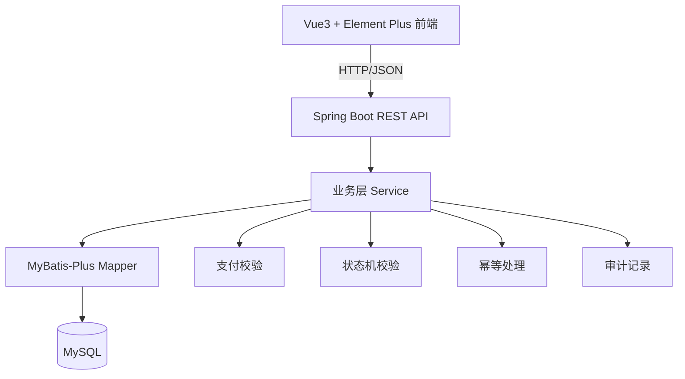
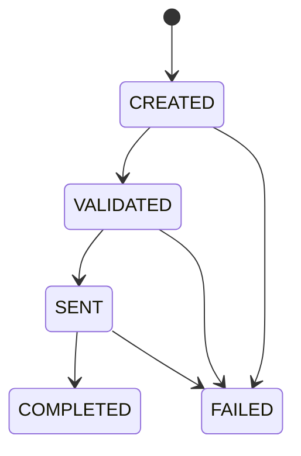
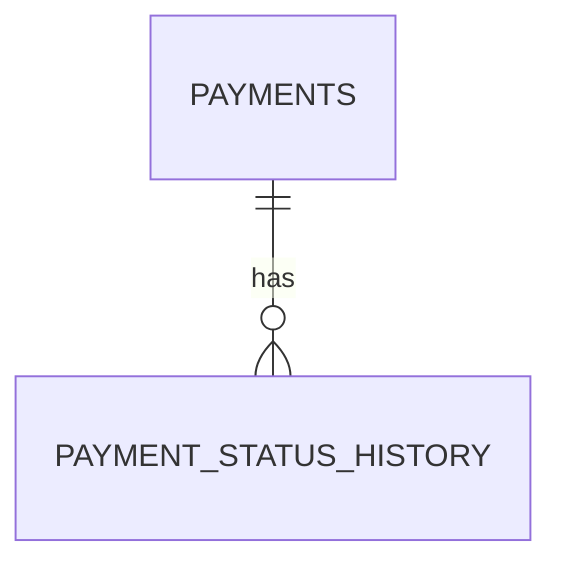

# 支付处理系统课程作业设计文档（Spring Boot + Vue）

## 1. 项目概述

### 1.1 项目背景
本项目用于实现一个金融支付处理页面应用，覆盖支付从创建到完成（或失败）的完整生命周期，并提供可追踪的状态变更审计记录（audit trail）。

### 1.2 项目目标
- 主要目标：实现 Payments Processing REST API。
- 次要目标：提供 Vue 前端页面，支持课程文档中要求的 5 项用户操作。

### 1.3 范围说明
- 单用户场景，无登录认证、无多租户。
- 使用 MySQL 持久化。
- 不对接真实支付网关，采用内部模拟处理流程。
- 仅实现需求文档提及的功能，不扩展复杂企业级能力。

---

## 2. 需求分析

### 2.1 功能需求（严格对应课程文档）
1. 创建新的支付。
2. 查看支付状态和详情。
3. 查看支付历史（所有状态转换）。
4. 按状态搜索/筛选支付。
5. 查看失败支付的错误详情。

### 2.2 非功能需求
- 幂等性：同一个 idempotency key 的重复请求要可控处理。
- 合法状态转换：禁止非法状态回退或跳转。
- 可审计性：每次状态变更记录时间、来源与错误信息。
- 一致性：支付主表与历史表写入需事务一致。
- 可维护性：采用分层架构，业务逻辑与持久化分离。

### 2.3 约束与假设
- 无需用户体系和权限控制。
- 账户有效性在本系统内做基础格式与模拟校验。
- 失败类型通过标准错误码返回，便于前端程序化处理。

---

## 3. 总体架构设计

### 3.1 分层架构


### 3.2 技术栈

| 层级 | 技术 | 说明 |
|---|---|---|
| 前端 | Vue 3 + Element Plus + Vite + Axios | 页面构建、组件化、接口调用 |
| 后端 | Spring Boot 3.x + JDK 22 + Maven | REST API 与业务实现 |
| 持久层 | MyBatis-Plus | ORM/CRUD 与乐观锁支持 |
| 数据库 | MySQL 8.x | 支付数据与状态历史存储 |
| API 文档 | springdoc-openapi + Swagger UI（可选 Knife4j） | 接口可视化与调试 |

### 3.3 前后端交互
- 前端通过 Axios 调用后端 `/api/**`。
- 开发期使用 Vite 代理或后端 CORS 配置。
- 统一响应结构，前端统一处理业务错误。

---

## 4. 支付生命周期与状态机设计

### 4.1 生命周期


### 4.2 状态定义
- CREATED：支付已提交，未完成规则验证。
- VALIDATED：支付通过验证，可发送。
- SENT：已发送到目标系统（内部模拟）。
- COMPLETED：处理成功并确认。
- FAILED：任意阶段失败，携带错误码。

### 4.3 合法状态转换规则
| 当前状态 | 允许目标状态 |
|---|---|
| CREATED | VALIDATED, FAILED |
| VALIDATED | SENT, FAILED |
| SENT | COMPLETED, FAILED |
| COMPLETED | 无 |
| FAILED | 无 |

### 4.4 状态机实现策略
- 在 Service 层维护 `Map<PaymentStatus, Set<PaymentStatus>>` 规则。
- 每次状态更新先校验是否合法。
- 非法时抛出 `INVALID_STATUS_TRANSITION`，返回 HTTP 400。

### 4.5 流程处理策略
- 创建支付后，在同一事务中按步骤推进：
  - CREATED（入库）
  - VALIDATED（业务校验通过）
  - SENT（模拟发送）
  - COMPLETED 或 FAILED（模拟结果）
- 每一步都写入历史表，确保前端可查看完整时间线。
- 另提供手工状态流转接口用于测试非法流转与失败场景。

---

## 5. 数据库设计（MySQL）

### 5.1 ER 关系


### 5.2 表设计：payments

| 字段名 | 类型 | 约束 | 说明 |
|---|---|---|---|
| id | BIGINT | PK, AUTO_INCREMENT | 主键 |
| idempotency_key | VARCHAR(64) | UNIQUE, NOT NULL | 幂等键 |
| from_account | VARCHAR(50) | NOT NULL | 源账户 |
| to_account | VARCHAR(50) | NOT NULL | 目标账户 |
| amount | DECIMAL(18,2) | NOT NULL | 金额 |
| currency | VARCHAR(3) | NOT NULL | 货币代码（ISO 4217） |
| status | VARCHAR(20) | NOT NULL | 当前状态 |
| error_code | VARCHAR(50) | NULL | 失败错误码 |
| error_message | VARCHAR(255) | NULL | 失败描述 |
| remark | VARCHAR(255) | NULL | 备注 |
| version | INT | NOT NULL DEFAULT 0 | 乐观锁版本号 |
| created_at | DATETIME | NOT NULL | 创建时间 |
| updated_at | DATETIME | NOT NULL | 更新时间 |

### 5.3 表设计：payment_status_history

| 字段名 | 类型 | 约束 | 说明 |
|---|---|---|---|
| id | BIGINT | PK, AUTO_INCREMENT | 主键 |
| payment_id | BIGINT | NOT NULL, FK | 关联支付ID |
| from_status | VARCHAR(20) | NULL | 变更前状态（首条可空） |
| to_status | VARCHAR(20) | NOT NULL | 变更后状态 |
| error_code | VARCHAR(50) | NULL | 失败错误码 |
| error_message | VARCHAR(255) | NULL | 错误描述 |
| remark | VARCHAR(255) | NULL | 补充备注 |
| operator | VARCHAR(50) | NOT NULL DEFAULT 'SYSTEM' | 触发者（SYSTEM/MANUAL） |
| created_at | DATETIME | NOT NULL | 变更时间 |

### 5.4 索引设计
- payments
  - uq_payments_idempotency_key（唯一）
  - idx_payments_status
- payment_status_history
  - idx_history_payment_id
  - fk_history_payment_id（外键）

### 5.5 建表 DDL（简版）
```sql
CREATE TABLE payments (
  id BIGINT PRIMARY KEY AUTO_INCREMENT,
  idempotency_key VARCHAR(64) NOT NULL UNIQUE,
  from_account VARCHAR(50) NOT NULL,
  to_account VARCHAR(50) NOT NULL,
  amount DECIMAL(18,2) NOT NULL,
  currency VARCHAR(3) NOT NULL,
  status VARCHAR(20) NOT NULL,
  error_code VARCHAR(50) NULL,
  error_message VARCHAR(255) NULL,
  remark VARCHAR(255) NULL,
  version INT NOT NULL DEFAULT 0,
  created_at DATETIME NOT NULL,
  updated_at DATETIME NOT NULL,
  INDEX idx_payments_status (status)
);

CREATE TABLE payment_status_history (
  id BIGINT PRIMARY KEY AUTO_INCREMENT,
  payment_id BIGINT NOT NULL,
  from_status VARCHAR(20) NULL,
  to_status VARCHAR(20) NOT NULL,
  error_code VARCHAR(50) NULL,
  error_message VARCHAR(255) NULL,
  remark VARCHAR(255) NULL,
  operator VARCHAR(50) NOT NULL DEFAULT 'SYSTEM',
  created_at DATETIME NOT NULL,
  INDEX idx_history_payment_id (payment_id),
  CONSTRAINT fk_history_payment_id FOREIGN KEY (payment_id) REFERENCES payments(id)
);
```

---

## 6. 后端框架结构与实现设计

### 6.1 建议项目结构
```text
src/main/java/com/example/payments
├─ config
├─ controller
├─ dto
│  ├─ request
│  └─ response
├─ entity
├─ enums
├─ exception
├─ mapper
├─ service
│  └─ impl
└─ statemachine
```

### 6.2 分层职责
- Controller
  - 参数接收与基础校验。
  - 调用 Service，返回统一响应。
- Service
  - 核心业务：幂等、验证、状态机、审计、事务。
- Mapper
  - MyBatis-Plus CRUD、分页、条件查询。
- Entity/DTO
  - Entity 对应数据库结构。
  - DTO 隔离前后端传输模型。

### 6.3 核心组件
- `PaymentStatus` 枚举：CREATED/VALIDATED/SENT/COMPLETED/FAILED。
- `ErrorCode` 枚举：课程附录 B 的全部错误码与默认提示。
- `PaymentException`：封装 errorCode + message + httpStatus。
- `GlobalExceptionHandler`：统一异常转换为标准响应。
- `PaymentStateMachine`：合法流转校验。
- `PaymentValidator`：金额、账户、货币验证规则。

### 6.4 验证规则实现
- 金额验证
  - > 0
  - <= 1,000,000
  - 小数位最多 2 位
- 账户验证
  - from_account != to_account
  - 账户格式满足约定正则
  - 账户存在性使用模拟校验
- 货币验证
  - 必须是受支持白名单：USD/EUR/GBP（可扩展）

### 6.5 幂等性实现
- 请求必须携带 `idempotencyKey`。
- 先按幂等键查询支付：
  - 存在：直接返回已存在支付（HTTP 200）。
  - 不存在：创建新支付。
- 数据库唯一索引做最终兜底，防并发重复写入。

### 6.6 事务与并发
- 使用 `@Transactional` 包裹创建+状态推进+历史记录。
- 更新状态使用乐观锁字段 `version` 防并发覆盖。

---

## 7. API 接口设计与实现说明

### 7.1 统一响应结构
```json
{
  "success": true,
  "data": {},
  "errorCode": null,
  "message": "OK"
}
```

分页 data 推荐结构：
```json
{
  "list": [],
  "total": 0,
  "page": 1,
  "size": 10
}
```

### 7.2 接口清单

| Method | Path | 说明 |
|---|---|---|
| POST | /api/payments | 创建支付（幂等） |
| GET | /api/payments/{id} | 查询支付详情 |
| GET | /api/payments/{id}/history | 查询支付状态历史 |
| GET | /api/payments | 支付列表分页+筛选 |
| PATCH | /api/payments/{id}/status | 手工状态流转（测试/模拟） |

### 7.3 关键接口定义

#### 7.3.1 创建支付
- Method/Path：POST /api/payments
- Request Body：
```json
{
  "idempotencyKey": "b4b7c4c0-ef3f-4a2f-8da3-57fa7a111111",
  "fromAccount": "ACC10001",
  "toAccount": "ACC20002",
  "amount": 1200.50,
  "currency": "USD",
  "remark": "invoice-2026-07"
}
```
- 成功返回：200（新建或幂等命中已存在）。

#### 7.3.2 查询支付详情
- Method/Path：GET /api/payments/{id}
- 返回字段：支付基础信息、当前状态、错误信息、时间戳。

#### 7.3.3 查询支付历史
- Method/Path：GET /api/payments/{id}/history
- 返回字段：fromStatus、toStatus、errorCode、operator、createdAt。

#### 7.3.4 列表查询与筛选
- Method/Path：GET /api/payments
- Query 参数：
  - status（可选）
  - keyword（可选，匹配支付ID或备注）
  - page（默认 1）
  - size（默认 10）

#### 7.3.5 手工状态流转
- Method/Path：PATCH /api/payments/{id}/status
- Request Body：
```json
{
  "targetStatus": "FAILED",
  "errorCode": "NETWORK_ERROR",
  "errorMessage": "mock network timeout"
}
```
- 用途：测试非法转换拦截、模拟失败、演示审计记录。

### 7.4 错误码与 HTTP 状态码

| Error Code | 描述 | HTTP Status |
|---|---|---|
| VALIDATION_FAILED | 支付未通过验证检查 | 400 |
| INSUFFICIENT_FUNDS | 源账户余额不足 | 400 |
| INVALID_ACCOUNT | 账户号码不合法或不存在 | 400 |
| INVALID_CURRENCY | 货币代码不受支持 | 400 |
| INVALID_AMOUNT | 金额为零、负数或不合法 | 400 |
| DUPLICATE_PAYMENT | 具有相同 idempotency key 的支付已存在 | 409 |
| INVALID_STATUS_TRANSITION | 无法从当前状态转换到请求的状态 | 400 |
| PAYMENT_NOT_FOUND | 支付 ID 不存在 | 404 |
| PROCESSING_ERROR | 支付处理过程中发生内部错误 | 500 |
| NETWORK_ERROR | 与支付网络通信失败 | 503 |

### 7.5 OpenAPI/Swagger
- 依赖：`springdoc-openapi-starter-webmvc-ui`。
- 注解：`@Tag`、`@Operation`、`@Schema`。
- 访问地址：`/swagger-ui.html`（或集成 Knife4j 的 `/doc.html`）。

---

## 8. 前端框架结构与页面功能设计（Vue3 + Element Plus）

### 8.1 路由设计
- / ：支付列表页
- /payments/create ：创建支付页
- /payments/:id ：支付详情页（含历史时间线）

### 8.2 页面功能

#### 8.2.1 支付列表页（PaymentList.vue）
- 展示列：支付ID、金额、货币、状态、创建时间。
- 支持按状态筛选。
- 支持关键字搜索（支付ID/备注）。
- 支持分页。
- 点击行跳转详情页。

#### 8.2.2 创建支付页（PaymentCreate.vue）
- 表单字段：源账户、目标账户、金额、货币、备注、幂等键。
- 前端表单校验：必填、金额格式、账户不同。
- 提交后显示成功/失败消息。

#### 8.2.3 支付详情页（PaymentDetail.vue）
- 展示支付基本信息和状态标签。
- 状态颜色：
  - COMPLETED：绿色
  - CREATED/VALIDATED/SENT：黄色系
  - FAILED：红色
- 展示时间线（history）。
- 若失败，展示 errorCode 与 errorMessage。

### 8.3 前端目录建议
```text
src
├─ api
│  └─ payment.js
├─ router
│  └─ index.js
├─ views
│  ├─ PaymentList.vue
│  ├─ PaymentCreate.vue
│  └─ PaymentDetail.vue
├─ store
│  └─ payment.js (可选)
└─ main.js
```

### 8.4 API 封装建议
- `src/api/payment.js` 封装 5 个接口。
- Axios 响应拦截器统一处理 `success=false`。
- 错误提示统一弹窗：显示 errorCode + message。

---

## 9. 幂等性与重试处理设计

### 9.1 幂等键策略
- 前端每次创建请求生成 UUID 作为 idempotencyKey。
- 后端先查再写，配合唯一索引。
- 客户端因网络问题重试同一请求时，不会产生重复支付。

### 9.2 重试策略（课程简化版）
- 外部调用失败由客户端重试，保持幂等键不变。
- 内部模拟发送阶段可配置最大重试次数（例如 3 次）。
- 超过重试次数则置为 FAILED，错误码 NETWORK_ERROR。

---

## 10. 测试要点（对应课程文档附录 F）

1. Happy Path：创建支付后按 CREATED→VALIDATED→SENT→COMPLETED。
2. 验证失败：负数金额、非法货币、同源同目标账户。
3. 重复检测：同 idempotency key 提交两次，第二次返回已有支付。
4. 非法状态转换：尝试 COMPLETED→CREATED，返回 INVALID_STATUS_TRANSITION。
5. 并发更新：并发更新同一支付，验证乐观锁与数据一致性。
6. 数据库故障：模拟持久化失败，验证事务回滚与错误返回。

---

## 11. Git 工作流建议（课程实践）

- 分支模型：main + feature/*。
- 每个功能点独立分支开发并发起 PR。
- 建议提交节奏：
  - 初始化骨架
  - 支付主流程
  - 状态历史与筛选
  - 页面联调与测试

---

## 12. 最小可交付版本（MVP）建议

第一版建议最小字段：
- id
- amount
- currency
- status
- idempotencyKey

在 MVP 跑通后，再补充账户字段、错误码、历史时间线与筛选功能。

---

## 13. 结论
本设计在课程作业范围内实现了完整支付生命周期管理方案，覆盖了前后端结构、状态机规则、幂等与错误码体系、接口设计与数据库设计，可直接作为项目实现蓝图与答辩文档基础。